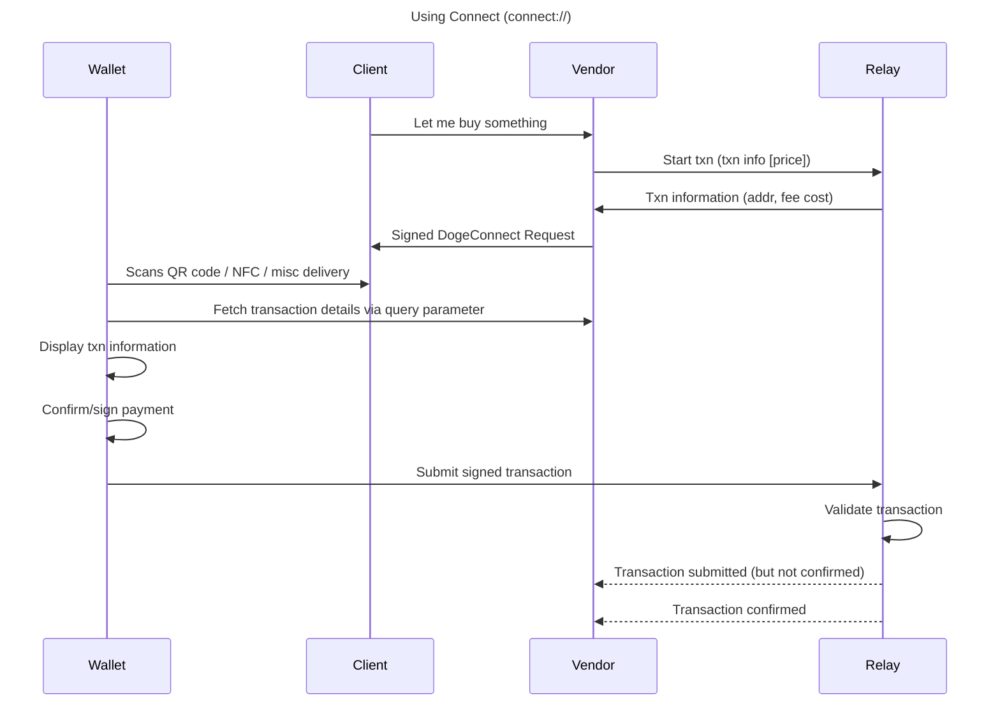

## What is Doge Connect?

Doge Connect is a Payment Protocol for transmitting detail-rich _Payment Requests_ from a 
_Vendor_ to a _Client Wallet_ and receiving a _Payment Response_ containing a transaction 
which the vendor can validate and relay to the network via a _Payment Relay_.

Doge Connect comprises an _Payment Envelope_ JSON schema, as well as a set of APIs
that complete the system. Through Doge Connect it is expected that Vendors can issue
detailed payment requests to customers with itemised goods and services as well as taxes 
and fees, which the client Wallet can display to the user. In the Doge Connect model the 
vendor can validate the transaction and determine their desired risk appetite, allowing 
for ZeroConf payment through to as many validations as desired. 

## Document Status:  WIP

Over the next weeks this document will develop as the specification is refined and supporting 
software is built to demonstrate the protocol.

