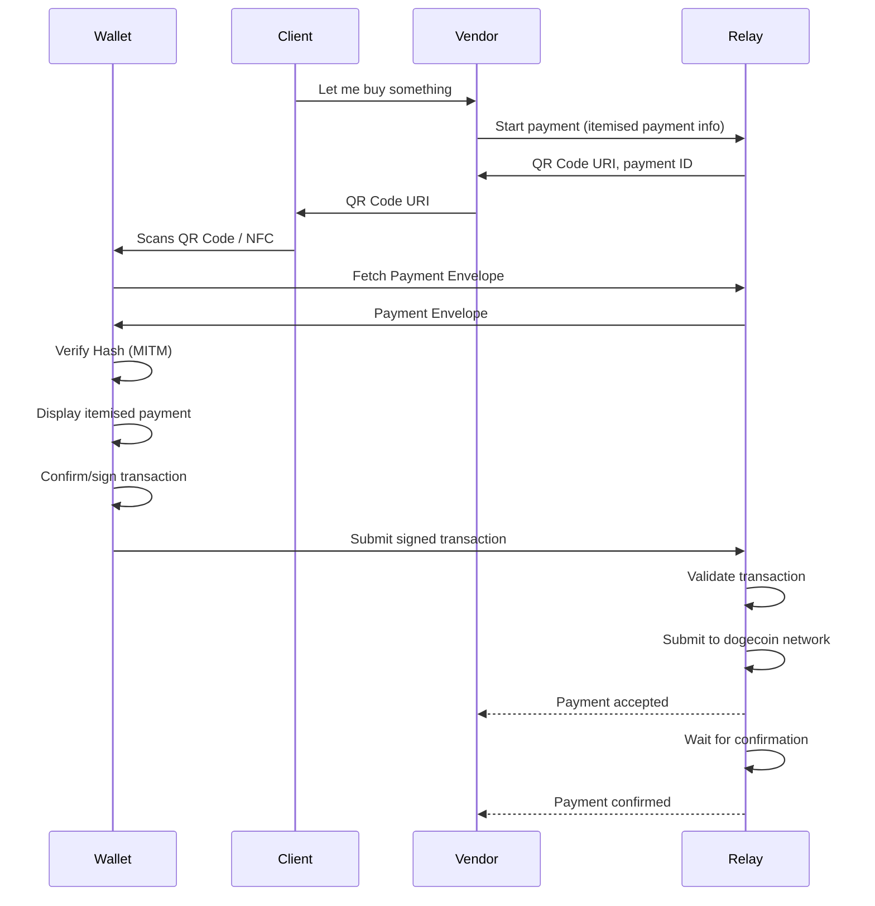

## What is DogeConnect?

DogeConnect is a payment protocol for transmitting a detail-rich _Payment Request_ from a
_Vendor_ to a _Client Wallet_ and receiving a _Payment Response_ containing a signed
transaction, which is validated and relayed to the network by a _Payment Relay_.

**Note: this specification is ready to implement; please provide implementation feedback.**

DogeConnect comprises:
* a _Payment QR Code_ specification,
* a _Payment Envelope_ JSON schema,
* an API specification for an internet _Payment Relay_.

Through DogeConnect,
_Vendors_ can issue detailed payment requests to customers with itemised goods and
services as well as taxes and fees, which the _Client Wallet_ can display to the user
along with the vendor's name and logo.

In the DogeConnect model, the vendor or their nominated _Payment Relay_ validates
the transaction and determines their desired risk appetite, the number of blockchain
confirmations they require, etc.

